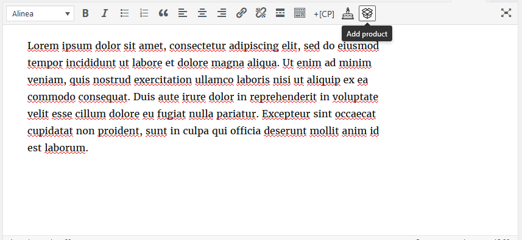
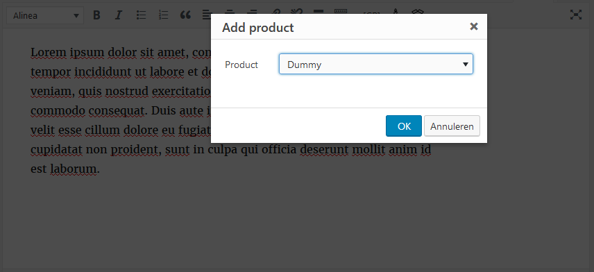
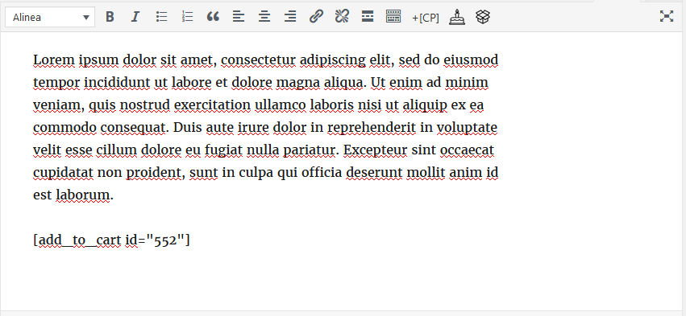
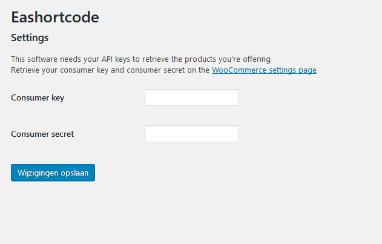

# Eashortcode
Contributors: lucvanderzandt
Tags: WooCommerce, shortcode
Donate link: https://paypal.me/lucvanderzandt
Requires at least: 4.7
Tested up to: 4.8
Stable tag: trunk
License: GPLv3
License URI: https://www.gnu.org/licenses/gpl-3.0.html

A WordPress plugin to easily add a WooCommerce "Add to cart" button in Visual Editor (TinyMCE)

## Description

This plugin provides WordPress' Visual Editor with a button to easily add a WooCommerce add_to_cart buttons to a blogpost or page. The user clicks on a small icon at the top right of Visual Editor showing an open box, choose a product, confirm and there you go! Goodbye looking up and memorizing all the product SKUs or exact names!

## Installation

To install Eashortcode, follow these steps:

1. Upload the plugin files to the `/wp-content/plugins/eashortcode` directory, or install the plugin through the WordPress plugins screen directly
1. Activate the plugin through the 'Plugins' screen in WordPress
1. Use the Settings->Eashortcode screen to configure your WooCommerce API keys. The plugin needs these to access your product offerings. Instructions on how to retrieve the API keys are to be found on this screen

## Frequently Asked Questions

### Why does Eashortcode need my WooCommerce API keys?

Eashortcode needs your WooCommerce API keys to retrieve a list of your product offerings to choose from in Visual Editor. If in any doubt about the trustability of this software, please feel free to inspect the [source code](https://github.com/lucvanderzandt/eashortcode)

### I have questions/suggestions/feedback to the developer, how can I contact you?

Sure! You can contact me via the [WordPress forums](https://wordpress.org/support/plugin/eashortcode), send me a mail at <lucvanderzandt@kpnplanet.nl> or tweet me at [@lucvanderzandt](https://twitter.com/lucvanderzandt)

## Screenshots

## Changelog

### 1.0
* Initial version

## Upgrade Notice

No upgrade notices yet
